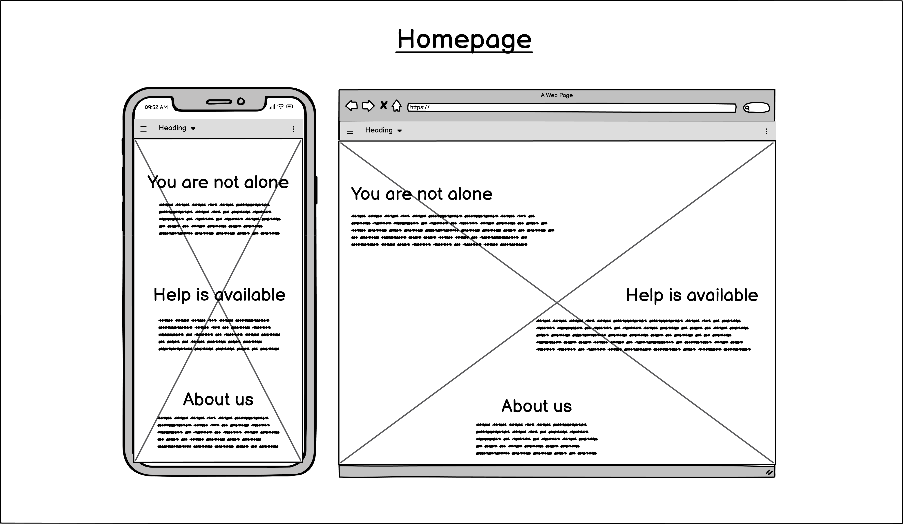

# MindMatters

MindMatters is a website dedicated to providing mental health resources, support, and information to help individuals navigate mental health challenges. Our goal is to empower users with a range of resources and support systems for mental health awareness and well-being.

## Table of Contents

- [Features](#features)
- [Technologies Used](#technologies-used)
- [Usage](#usage)
- [Contributing](#contributing)
- [License](#license)
- [Contact](#contact)

## Features

- Clean, simple design and gentle animation for a calming user experience
- "Myth vs Truth" interactive section disspelling myths about mental health
- Links to external websites

## Technologies Used

- HTML5
- CSS3
- Bootstrap 5
- Google Fonts

## Wireframes

